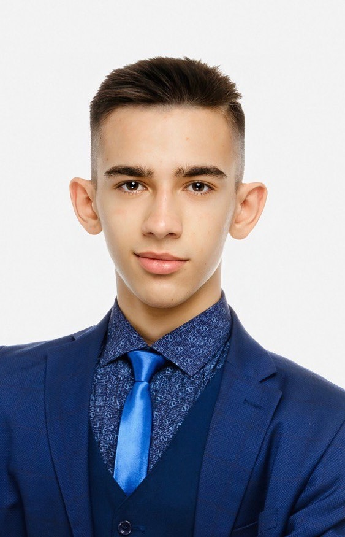

# Арсений Колесников

  

> Студент направления «Математические основы искусственного интеллекта», ищу стажировку в Machine Learning. Имею практику подготовки табличных данных, обучения и валидации моделей классификации в Python; работаю с pandas, NumPy и scikit-learn. Понимаю базовый ML-пайплайн: разделение данных, работу с признаками, вероятностные предсказания и метрики качества. Умею пользоваться GitHub, Docker и SQL; готов быстро углубляться в задачи команды под руководством наставника.

---

### 📧 Контакты
* **GitHub:** [github.com/Ar2rito](https://github.com/Ar2rito)
* **Telegram:** [@arcenix](https://t.me/arcenix)
* **Email:** 3451445@gmail.com
* **Локация:** Казань / Иннополис (удалённо / гибрид)

---

### 🛠 Ключевые навыки и знания

* **Python для анализа данных:** Python, pandas, NumPy; загрузка и проверка CSV-данных, работа с таблицами и массивами.
* **Классическое машинное обучение:** scikit-learn, дерево решений, бинарная классификация, формирование матриц признаков и целевого вектора, `predict_proba`.
* **Оценка моделей:** выделенная валидационная выборка, ROC-AUC, проверка качества и целостности данных, воспроизводимость экспериментов через фиксированный `random_state`.
* **Инженерные инструменты:** GitHub, Git (ветвление, pull request, разрешение конфликтов), Docker (Dockerfile, образы, контейнеры, volumes), Linux и базовый bash.
* **Данные и интеграции:** базовый SQL, JSON, REST API; интеграция LLM API (DeepSeek/OpenRouter) в Python-проекте.

---

### 🚀 Практический опыт и учебные проекты

#### 1. Hidden Pairs — *Учебный ML-проект по бинарной классификации табличных данных*
*Разработал воспроизводимый ноутбук для предсказания совпадения скрытых объектов по анонимизированным числовым признакам.*

* Загрузил и провалидировал train, validation и test-наборы: проверил схему, пропуски, уникальность идентификаторов и согласованность 512 признаков.
* Сформировал матрицы признаков и целевые векторы; обучил `DecisionTreeClassifier` из scikit-learn с ограничением глубины и минимального размера листа.
* Получил вероятностные предсказания и оценил модель на независимой валидационной выборке: **ROC-AUC 0,7473**.
* Сформировал файл для отправки в требуемой схеме и добавил автоматические проверки диапазона вероятностей, порядка ID и отсутствия пропусков.

#### 2. Cleaning Avsallar Bot, [@cleanavs_bot](https://t.me/cleanavs_bot) — *Python-проект с LLM API*
*Telegram-бот для автоматизации клиентских коммуникаций.*

* Реализовал базовую логику на Python с `aiogram`, middleware и раздельными роутерами по ролям.
* Интегрировал API DeepSeek/OpenRouter для обработки обращений в свободной форме.
* Работал с API, JSON и отладкой сетевой связности в условиях ограниченных ресурсов.

#### 3. [DevOps-Intro: лабораторные работы](https://github.com/Ar2rito/DevOps-Intro/tree/main/labs) — *Инженерный практикум*
*Серия учебных работ, помогающих воспроизводимо запускать и документировать проекты.*

* Работал с Docker-контейнерами: Dockerfile, multi-stage сборки, сети и volumes.
* Настраивал базовые пайплайны GitHub Actions и документировал результаты в Markdown.
* Использовал Linux CLI для диагностики окружения и работы с файлами.

---

### 🎓 Образование
**Университет Иннополис**, бакалавриат (3 курс)  
*Специальность:* «Математические основы искусственного интеллекта»

* Профильные предметы: математическое моделирование, алгоритмы, базы данных (SQL/JSON), архитектура вычислительных систем, операционные системы.

---

### 🗣 Soft Skills & Языки
* **Работа с документацией:** структурно фиксирую ход экспериментов, проверки и результаты в Markdown и Jupyter Notebook.
* **Самостоятельность:** умею разбираться в незнакомых инструментах по документации и доводить учебные задачи до воспроизводимого результата.
* **Английский язык:** B2 (Upper-Intermediate) — уверенное чтение технической документации.
* **Немецкий язык:** B2 (DSD-II).
