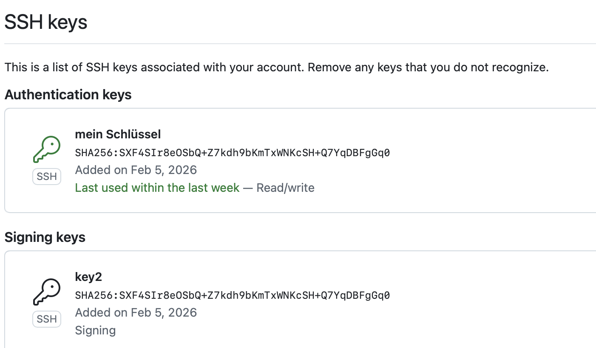
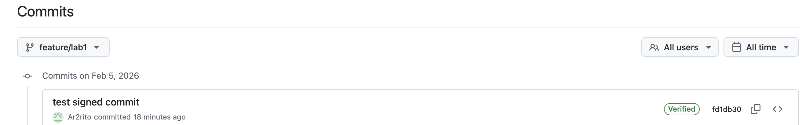

Kolesnikov Arsenii Mfai-02 Innopolis
Можно подписывать коммиты и теги локально, чтобы другие пользователи были уверены в происхождении внесенных вами изменений. Если у фиксации или тега есть криптографически проверяемая подпись GPG, SSH или S/MIME, GitHub помечает фиксацию или тег как "Проверенные" или "Частично проверенные". Подписанные коммиты помогают командам DevOps проверять, что изменения в коде были внесены реальными и доверенными разработчиками. Это повышает безопасность CI/CD-пайплайнов, защищает от внедрения вредоносного кода и позволяет автоматически проверять источник изменений перед сборкой и деплоем. Благодаря криптографической подписи команды могут доверять истории репозитория и снижать риски атак на цепочку поставки программного обеспечения
