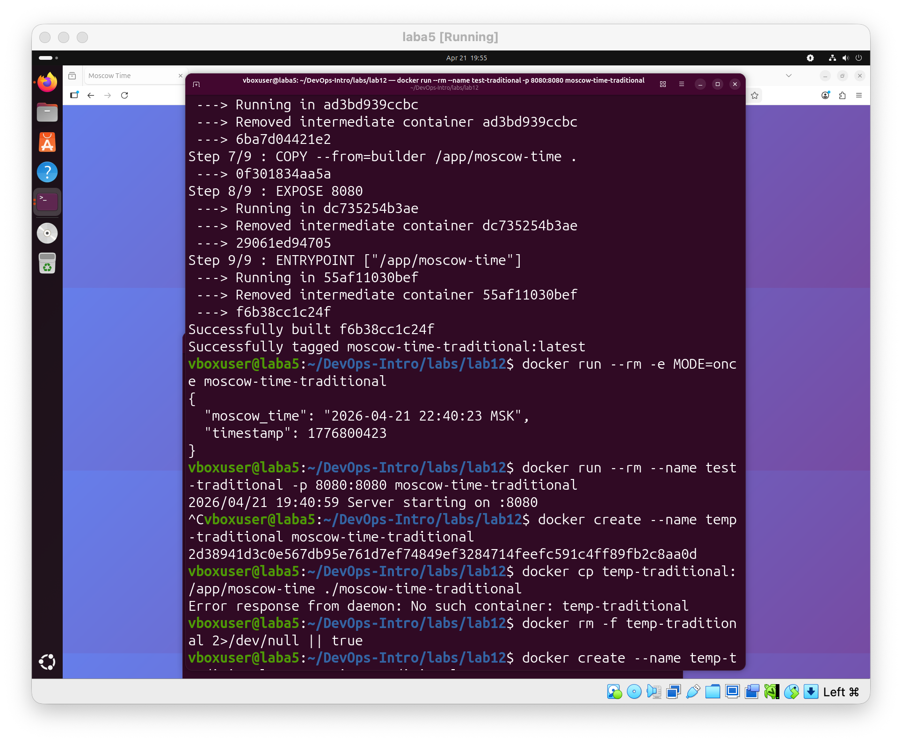
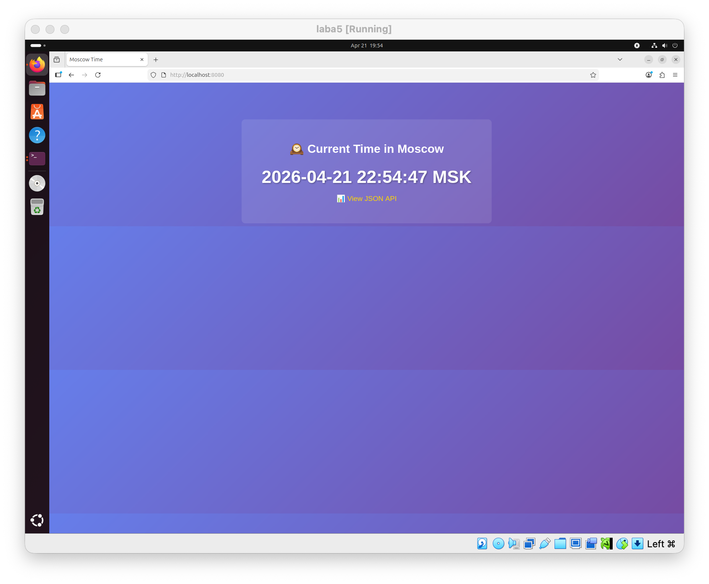
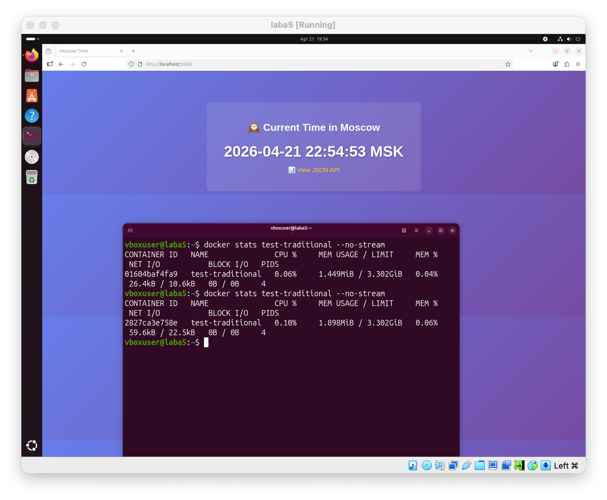
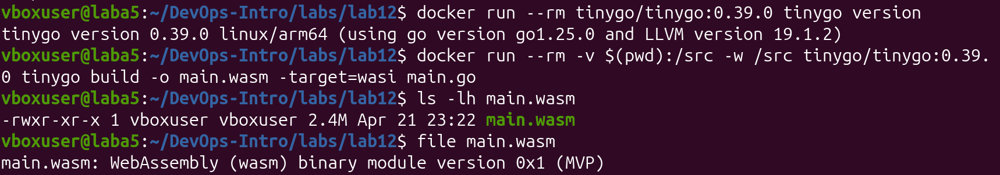
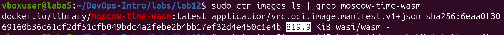
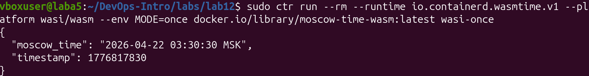
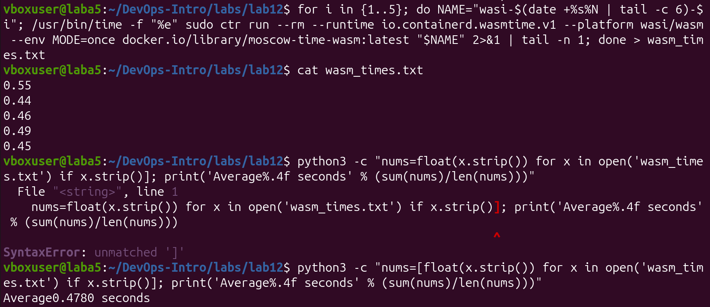

# Lab 12 — WebAssembly Containers vs Traditional Containers

## Task 1 — Create the Moscow Time Application

В рамках первого задания я работал непосредственно в директории `labs/lab12`, где уже были предоставлены все необходимые файлы: `main.go`, `Dockerfile`, `Dockerfile.wasm` и `spin.toml`.

Сначала я проверил работу приложения в CLI-режиме. Для этого была выполнена команда:

```bash
cd ~/DevOps-Intro/labs/lab12
MODE=once go run main.go
```

В результате программа вывела JSON-ответ с текущим временем Москвы и Unix timestamp:

```json
{
  "moscow_time": "2026-04-21 22:13:16 MSK",
  "timestamp": 1776798796
}
```

Это подтверждает, что приложение корректно работает в режиме однократного запуска (`MODE=once`), который позже используется для benchmarking как в traditional container, так и в WASM container.


После этого я проверил работу приложения в режиме HTTP-сервера. Для запуска была использована команда:

```bash
go run main.go
```

После запуска в терминале появилось сообщение:

```bash
2026/04/21 19:13:27 Server starting on :8080
```

Затем в браузере был открыт адрес:

```text
http://localhost:8080
```

Приложение успешно отобразило веб-страницу с текущим временем в Москве.


Один и тот же файл `main.go` работает в трёх различных контекстах:
- `MODE=once` запускает приложение в CLI-режиме и выводит JSON один раз
- обычный запуск `go run main.go` поднимает стандартный HTTP-сервер на базе `net/http`
- при запуске в среде Spin приложение определяет WAGI-контекст через переменные окружения, например `REQUEST_METHOD`, и обрабатывает запрос в CGI/WAGI-формате

Таким образом, одно и то же исходное приложение используется для traditional Docker container, WASM container и Spin deployment без изменения основной логики программы.

## Task 2 — Build Traditional Docker Container

В рамках второго задания я собрал и протестировал traditional Docker container для того же самого приложения на Go.

Сначала был изучен предоставленный `Dockerfile`. Он использует multi-stage build: на этапе сборки применяется образ `golang:1.21-alpine`, а итоговый контейнер создаётся на базе `scratch`, что позволяет получить минимальный по размеру образ. Бинарный файл собирается как статически слинкованное приложение без внешних зависимостей.

Для очистки старых контейнеров и образов были выполнены команды:

```bash
docker rm -f test-traditional test-wasm 2>/dev/null || true
docker image prune -f 2>/dev/null || true
```

После этого был собран Docker-образ:

```bash
docker build -t moscow-time-traditional -f Dockerfile .
```

Сборка завершилась успешно:

```bash
Successfully built f6b38cc1c24f
Successfully tagged moscow-time-traditional:latest
```

Затем был протестирован CLI-режим контейнера:

```bash
docker run --rm -e MODE=once moscow-time-traditional
```

Контейнер корректно вывел JSON с текущим московским временем:

```json
{
  "moscow_time": "2026-04-21 22:40:23 MSK",
  "timestamp": 1776800423
}
```



После этого был протестирован server mode:

```bash
docker run --rm --name test-traditional -p 8080:8080 moscow-time-traditional
```

После запуска в терминале появилось сообщение:

```bash
2026/04/21 19:52:59 Server starting on :8080
```

Затем в браузере был открыт адрес:

```text
http://localhost:8080
```

Приложение успешно открылось в браузере и отобразило веб-страницу с текущим временем в Москве.



Далее был измерен размер бинарного файла. Для этого бинарник был извлечён из контейнера:

```bash
docker create --name temp-traditional moscow-time-traditional
docker cp temp-traditional:/app/moscow-time ./moscow-time-traditional
docker rm temp-traditional
ls -lh moscow-time-traditional
```

Результат:

```bash
-rwxr-xr-x 1 vboxuser vboxuser 4.4M Apr 21 19:39 moscow-time-traditional
```

Затем был измерен размер Docker image:

```bash
docker images moscow-time-traditional
docker image inspect moscow-time-traditional --format '{{.Size}}' | awk '{print $1/1024/1024 " MB"}'
```

Результаты:

```bash
REPOSITORY                 TAG       IMAGE ID       CREATED         SIZE
moscow-time-traditional    latest    f6b38cc1c24f   7 minutes ago   4.59MB
```

```bash
4.375 MB
```

После этого был выполнен benchmark времени запуска контейнера в CLI-режиме:

```bash
for i in {1..5}; do
    /usr/bin/time -f "%e" docker run --rm -e MODE=once moscow-time-traditional 2>&1 | tail -n 1
done | awk '{sum+=$1; count++} END {print "Average:", sum/count, "seconds"}'
```

Среднее время запуска:

```bash
Average: 3.42 seconds
```

Для оценки потребления памяти контейнер был запущен в server mode, после чего использовалась команда:

```bash
docker stats test-traditional --no-stream
```

Полученные значения:

```bash
CONTAINER ID   NAME               CPU %     MEM USAGE / LIMIT     MEM %
01604baf4fa9   test-traditional   0.06%     1.449MiB / 3.302GiB   0.04%
2827ca3e758e   test-traditional   0.10%     1.898MiB / 3.302GiB   0.06%
```

Таким образом, использование памяти находилось примерно в диапазоне `1.4-1.9 MiB`.



В результате второго задания traditional Docker container был успешно собран и протестирован. Контейнер корректно работает как в CLI-режиме, так и в режиме HTTP-сервера, а также предоставляет значения, необходимые для дальнейшего сравнения с WASM container.

## Task 3 — Build WASM Container (ctr-based)

В рамках третьего задания я собрал WebAssembly container из того же самого файла `main.go`, используя TinyGo, OCI image archive и запуск через `ctr` с runtime `io.containerd.wasmtime.v1`.

Сначала была зафиксирована версия TinyGo:

```bash
docker run --rm tinygo/tinygo:0.39.0 tinygo version
```

Результат:

```bash
tinygo version 0.39.0 linux/arm64 (using go version go1.25.0 and LLVM version 19.1.2)
```

После этого WASM-бинарник был собран из того же исходного файла `main.go`:

```bash
docker run --rm -v $(pwd):/src -w /src tinygo/tinygo:0.39.0 tinygo build -o main.wasm -target=wasi main.go
```

Проверка созданного файла:

```bash
ls -lh main.wasm
file main.wasm
```

Результаты:

```bash
-rwxr-xr-x 1 vboxuser vboxuser 2.4M Apr 21 23:22 main.wasm
```

```bash
main.wasm: WebAssembly (wasm) binary module version 0x1 (MVP)
```



Далее был собран и установлен `containerd-shim-wasmtime-v1`, после чего runtime `wasmtime` был зарегистрирован в конфигурации `containerd`. Проверка активной конфигурации показала наличие runtime:

```bash
sudo containerd config dump | grep -n -A 4 -B 2 wasmtime
```

Результат:

```bash
[plugins.'io.containerd.cri.v1.runtime'.containerd.runtimes.wasmtime]
  runtime_type = 'io.containerd.wasmtime.v1'
  [plugins.'io.containerd.cri.v1.runtime'.containerd.runtimes.wasmtime.options]
    BinaryName = '/usr/local/bin/containerd-shim-wasmtime-v1'
```

Так как OCI exporter не поддерживается стандартным `docker` driver, был создан отдельный builder с `docker-container` driver:

```bash
docker buildx create --name wasm-builder --driver docker-container --use
docker buildx inspect --bootstrap
docker buildx ls
```

После этого OCI archive был собран с использованием `Dockerfile.wasm`:

```bash
docker buildx build --builder wasm-builder --platform=wasi/wasm -t moscow-time-wasm:latest -f Dockerfile.wasm --output=type=oci,dest=moscow-time-wasm.oci .
```

Затем образ был импортирован в `containerd`:

```bash
sudo ctr images import --platform=wasi/wasm --index-name docker.io/library/moscow-time-wasm:latest moscow-time-wasm.oci
```

Проверка импортированного образа:

```bash
sudo ctr images ls | grep moscow-time-wasm
```

Результат:

```bash
docker.io/library/moscow-time-wasm:latest application/vnd.oci.image.manifest.v1+json sha256:6eaa0f3069160b36c61cf2df51cfb049bdc4a2febe2b4bb17ef32d4e450c1e4b 819.9 KiB wasi/wasm
```



После этого контейнер был успешно запущен через `ctr` в CLI-режиме:

```bash
sudo ctr run --rm --runtime io.containerd.wasmtime.v1 --platform wasi/wasm --env MODE=once docker.io/library/moscow-time-wasm:latest wasi-once
```

Результат:

```json
{
  "moscow_time": "2026-04-22 03:30:30 MSK",
  "timestamp": 1776817830
}
```

Это подтверждает, что WASM container был успешно выполнен через `ctr`, и для сборки использовался тот же исходный файл `main.go`, что и в traditional container.



Размер WASM binary:

```bash
ls -lh main.wasm
```

```bash
-rwxr-xr-x 1 vboxuser vboxuser 2.4M Apr 21 23:22 main.wasm
```

Размер WASI image:

```bash
sudo ctr images ls | grep moscow-time-wasm
```

```bash
docker.io/library/moscow-time-wasm:latest application/vnd.oci.image.manifest.v1+json sha256:6eaa0f3069160b36c61cf2df51cfb049bdc4a2febe2b4bb17ef32d4e450c1e4b 819.9 KiB wasi/wasm
```

Затем был выполнен benchmark времени запуска WASM container в CLI-режиме:

```bash
for i in 1 2 3 4 5; do
  NAME=wasi-$i-$(date +%s)
  /usr/bin/time -f %e sudo ctr run --rm --runtime io.containerd.wasmtime.v1 --platform wasi/wasm --env MODE=once docker.io/library/moscow-time-wasm:latest $NAME 2>&1 | tail -n 1
done > wasm_times.txt
cat wasm_times.txt
python3 -c "nums=[float(x.strip()) for x in open('wasm_times.txt') if x.strip()]; print('Average: %.4f seconds' % (sum(nums)/len(nums)))"
```

Полученные значения:

```bash
0.55
0.44
0.46
0.49
0.45
```

Среднее время запуска:

```bash
Average: 0.4780 seconds
```



Server mode под обычным `ctr` не поддерживается для данного WASM binary, потому что plain WASI Preview1 не предоставляет TCP sockets. По этой причине стандартный `net/http` server не может открыть сетевой сокет внутри обычного WASI runtime. При этом тот же самый `main.wasm` может быть использован в Spin, где HTTP-запросы обрабатываются через WAGI.

Memory usage: `N/A`.

Стандартное измерение memory usage для WASM container через `ctr` недоступно, поскольку WASM использует другую модель выполнения и привычные метрики Docker/cgroups здесь не предоставляются в том же виде.

Таким образом, в рамках третьего задания был успешно собран и запущен WASM container через `ctr`, использующий тот же исходный код `main.go`, что и traditional container.


## Task 4 — Performance Comparison & Analysis

В рамках четвёртого задания было выполнено сравнение traditional container и WASM container, собранных из одного и того же исходного файла `main.go`.

### Comparison Table

| Metric | Traditional Container | WASM Container | Improvement | Notes |
|--------|------------------------|----------------|-------------|-------|
| **Binary Size** | 4.4 MB | 2.4 MB | 45.5% smaller | From `ls -lh` |
| **Image Size** | 4.375 MB | 819.9 KiB (~0.80 MB) | 81.7% smaller | Traditional: `docker image inspect`, WASM: `ctr images ls` |
| **Startup Time (CLI)** | 3420 ms | 478 ms | 7.15x faster | Average of 5 runs |
| **Memory Usage** | 1.449-1.898 MiB | N/A | N/A | Traditional: `docker stats`, WASM via `ctr`: not available |
| **Base Image** | `scratch` | `scratch` | Same | Both minimal |
| **Source Code** | `main.go` | `main.go` | Identical | Same file used for both builds |
| **Server Mode** | Works (`net/http`) | Not via `ctr`, but works via Spin (WAGI) | N/A | WASI Preview1 lacks sockets |

### Calculations

- Binary size reduction: `((4.4 - 2.4) / 4.4) × 100 = 45.5%`
- Image size reduction: `((4.375 - 0.8007) / 4.375) × 100 ≈ 81.7%`
- Startup speed improvement: `3.42 / 0.478 ≈ 7.15x`
- Memory reduction: `N/A`, because memory usage for WASM via `ctr` is not exposed in the same way as for traditional Linux containers

### Analysis

#### 1. Binary Size Comparison

WASM binary получился заметно меньше traditional Go binary, потому что TinyGo использует гораздо более компактный runtime, чем стандартный компилятор Go. В traditional container был собран полноценный statically linked Linux binary, включающий более тяжёлый Go runtime и дополнительные части стандартной библиотеки.

TinyGo оптимизирует итоговый размер за счёт более агрессивного удаления неиспользуемого кода, меньшего runtime и упрощённой модели выполнения. В результате WASM binary оказался меньше, даже несмотря на то, что исходный код приложения остался тем же самым.

#### 2. Startup Performance

WASM container запускается быстрее, потому что его образ значительно меньше, а сам модуль проще по структуре и быстрее инициализируется в sandboxed runtime. В данном эксперименте среднее время запуска составило `0.4780 seconds` против `3.42 seconds` у traditional container.

У traditional container присутствует дополнительный overhead: запуск контейнера Docker, создание процесса Linux binary, инициализация полноценного Go runtime и обработка контейнерной среды выполнения. У WASM через `ctr` и `wasmtime` путь запуска короче, особенно для CLI one-shot сценария.

#### 3. Use Case Decision Matrix

WASM стоит выбирать в тех случаях, когда важны:

- минимальный размер образа
- быстрый startup
- безопасная sandboxed execution model
- serverless и edge-сценарии
- короткоживущие CLI или event-driven задачи

Traditional containers стоит выбирать в тех случаях, когда нужны:

- полноценные сетевые возможности
- обычный `net/http` server без дополнительных платформ
- широкая совместимость с Linux runtime
- более зрелая экосистема инструментов
- приложения с длительным временем жизни и стандартной container orchestration моделью

### Recommendations

По результатам эксперимента можно сделать вывод, что WASM container лучше подходит для лёгких, быстро стартующих и хорошо изолированных задач, особенно если приложение выполняется как короткий one-shot process или serverless workload.

Traditional container остаётся более универсальным вариантом для обычных backend-сервисов, потому что он напрямую поддерживает сетевой стек, стандартную модель развертывания и привычные механизмы мониторинга, такие как `docker stats`.
