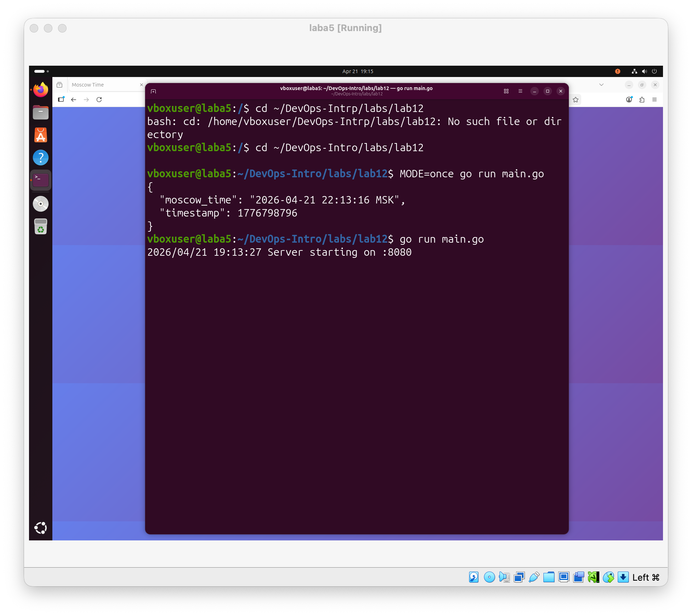
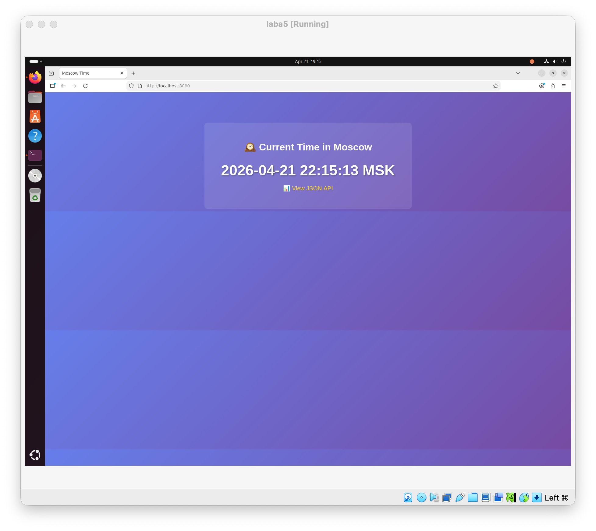

# Lab 12 — WebAssembly Containers vs Traditional Containers

## Task 1 — Create the Moscow Time Application

В рамках первого задания я работал непосредственно в директории `labs/lab12`, где уже были предоставлены все необходимые файлы: `main.go`, `Dockerfile`, `Dockerfile.wasm` и `spin.toml`.

Сначала я проверил работу приложения в CLI-режиме. Для этого была выполнена команда:

```bash
cd ~/DevOps-Intro/labs/lab12
MODE=once go run main.go
```

В результате программа вывела JSON-ответ с текущим временем Москвы и Unix timestamp:

```json
{
  "moscow_time": "2026-04-21 22:13:16 MSK",
  "timestamp": 1776798796
}
```

Это подтверждает, что приложение корректно работает в режиме однократного запуска (`MODE=once`), который позже используется для benchmarking как в traditional container, так и в WASM container.



После этого я проверил работу приложения в режиме HTTP-сервера. Для запуска была использована команда:

```bash
go run main.go
```

После запуска в терминале появилось сообщение:

```bash
2026/04/21 19:13:27 Server starting on :8080
```

Затем в браузере был открыт адрес:

```text
http://localhost:8080
```

Приложение успешно отобразило веб-страницу с текущим временем в Москве.



Один и тот же файл `main.go` работает в трёх различных контекстах:
- `MODE=once` запускает приложение в CLI-режиме и выводит JSON один раз
- обычный запуск `go run main.go` поднимает стандартный HTTP-сервер на базе `net/http`
- при запуске в среде Spin приложение определяет WAGI-контекст через переменные окружения, например `REQUEST_METHOD`, и обрабатывает запрос в CGI/WAGI-формате

Таким образом, одно и то же исходное приложение используется для traditional Docker container, WASM container и Spin deployment без изменения основной логики программы.

## Task 2 — Build Traditional Docker Container

В рамках второго задания я собрал и протестировал traditional Docker container для того же самого приложения на Go.

Сначала был изучен предоставленный `Dockerfile`. Он использует multi-stage build: на этапе сборки применяется образ `golang:1.21-alpine`, а итоговый контейнер создаётся на базе `scratch`, что позволяет получить минимальный по размеру образ. Бинарный файл собирается как статически слинкованное приложение без внешних зависимостей.

Для очистки старых контейнеров и образов были выполнены команды:

```bash
docker rm -f test-traditional test-wasm 2>/dev/null || true
docker image prune -f 2>/dev/null || true
```

После этого был собран Docker-образ:

```bash
docker build -t moscow-time-traditional -f Dockerfile .
```

Сборка завершилась успешно:

```bash
Successfully built f6b38cc1c24f
Successfully tagged moscow-time-traditional:latest
```

Затем был протестирован CLI-режим контейнера:

```bash
docker run --rm -e MODE=once moscow-time-traditional
```

Контейнер корректно вывел JSON с текущим московским временем:

```json
{
  "moscow_time": "2026-04-21 22:40:23 MSK",
  "timestamp": 1776800423
}
```


После этого был протестирован server mode:

```bash
docker run --rm --name test-traditional -p 8080:8080 moscow-time-traditional
```

После запуска в терминале появилось сообщение:

```bash
2026/04/21 19:52:59 Server starting on :8080
```

Затем в браузере был открыт адрес:

```text
http://localhost:8080
```

Приложение успешно открылось в браузере и отобразило веб-страницу с текущим временем в Москве.


Далее был измерен размер бинарного файла. Для этого бинарник был извлечён из контейнера:

```bash
docker create --name temp-traditional moscow-time-traditional
docker cp temp-traditional:/app/moscow-time ./moscow-time-traditional
docker rm temp-traditional
ls -lh moscow-time-traditional
```

Результат:

```bash
-rwxr-xr-x 1 vboxuser vboxuser 4.4M Apr 21 19:39 moscow-time-traditional
```

Затем был измерен размер Docker image:

```bash
docker images moscow-time-traditional
docker image inspect moscow-time-traditional --format '{{.Size}}' | awk '{print $1/1024/1024 " MB"}'
```

Результаты:

```bash
REPOSITORY                 TAG       IMAGE ID       CREATED         SIZE
moscow-time-traditional    latest    f6b38cc1c24f   7 minutes ago   4.59MB
```

```bash
4.375 MB
```

После этого был выполнен benchmark времени запуска контейнера в CLI-режиме:

```bash
for i in {1..5}; do
    /usr/bin/time -f "%e" docker run --rm -e MODE=once moscow-time-traditional 2>&1 | tail -n 1
done | awk '{sum+=$1; count++} END {print "Average:", sum/count, "seconds"}'
```

Среднее время запуска:

```bash
Average: 3.42 seconds
```

Для оценки потребления памяти контейнер был запущен в server mode, после чего использовалась команда:

```bash
docker stats test-traditional --no-stream
```

Полученные значения:

```bash
CONTAINER ID   NAME               CPU %     MEM USAGE / LIMIT     MEM %
01604baf4fa9   test-traditional   0.06%     1.449MiB / 3.302GiB   0.04%
2827ca3e758e   test-traditional   0.10%     1.898MiB / 3.302GiB   0.06%
```

Таким образом, использование памяти находилось примерно в диапазоне `1.4-1.9 MiB`.


В результате второго задания traditional Docker container был успешно собран и протестирован. Контейнер корректно работает как в CLI-режиме, так и в режиме HTTP-сервера, а также предоставляет значения, необходимые для дальнейшего сравнения с WASM container.

