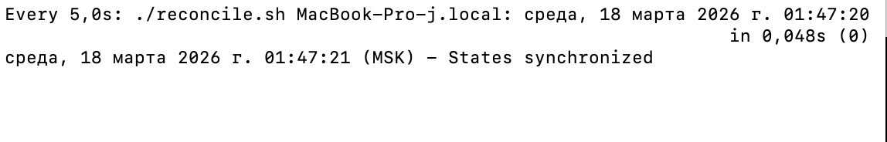
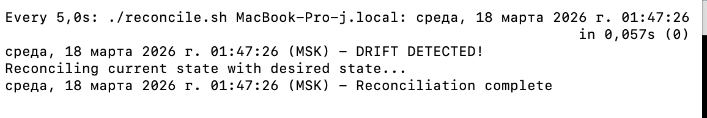
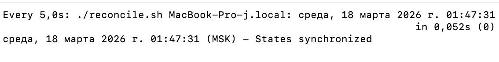

### Task 1 — Git State Reconciliation 

#### 1.1: Setup Desired State Configuration

1.  **Create Desired State (Source of Truth):**

   ```bash
   echo "version: 1.0" > desired-state.txt
   echo "app: myapp" >> desired-state.txt
   echo "replicas: 3" >> desired-state.txt
   ```

2.  **Simulate Current Cluster State:**

   ```bash
   cp desired-state.txt current-state.txt
   echo "Initial state synchronized"
   ```
   
_Output_: `Initial state synchronized`

**Initial desired-state.txt contents:**

```text
version: 1.0
app: myapp
replicas: 3
```

**Initial current-state.txt contents:**

```text
version: 1.0
app: myapp
replicas: 3
```

#### 1.2: Create Reconciliation Loop

1.  **Create Reconciliation Script:**

   ```bash
   cat > reconcile.sh <<'EOF'
   #!/bin/bash
   # reconcile.sh - GitOps reconciliation loop
   
   DESIRED=$(cat desired-state.txt)
   CURRENT=$(cat current-state.txt)
   
   if [ "$DESIRED" != "$CURRENT" ]; then
       echo "$(date) - DRIFT DETECTED!"
       echo "Reconciling current state with desired state..."
       cp desired-state.txt current-state.txt
       echo "$(date) - Reconciliation complete"
   else
       echo "$(date) - States synchronized"
   fi
   EOF
   ```

2.  **Make Script Executable:**

   ```bash
   chmod +x reconcile.sh
   ./reconcile.sh
   ```
   
_Output_: `среда, 18 марта 2026 г. 01:37:52 (MSK) - States synchronized`

#### 1.3: Test Manual Drift Detection

1.  **Simulate Manual Drift:**

   ```bash
   echo "version: 2.0" > current-state.txt
   echo "app: myapp" >> current-state.txt
   echo "replicas: 5" >> current-state.txt
   ```

 2.  **Run Reconciliation Manually:**

   ```bash
   ./reconcile.sh
   diff desired-state.txt current-state.txt
   ```
   
_Output_:

   ```bash
   среда, 18 марта 2026 г. 01:38:25 (MSK) - DRIFT DETECTED!
   Reconciling current state with desired state...
   среда, 18 марта 2026 г. 01:38:25 (MSK) - Reconciliation complete
   ```

3.  **Verify Drift Was Fixed:**

   ```bash
   cat current-state.txt
   ```
   
_Output_: 

   ```bash
   version: 1.0
   app: myapp
   replicas: 3
   ```

#### 1.4: Automated Continuous Reconciliation

1.  **Start Continuous Reconciliation Loop:**

   ```bash
   watch -n 5 ./reconcile.sh
   ```



2.  **In Another Terminal, Trigger Drift:**

   ```bash
   cd DevOps-Intro
   echo "replicas: 10" >> current-state.txt
   ```


3.  **Observe Auto-Healing:**

   Watch the reconciliation loop automatically detect and fix the drift within 5 seconds.



**Analysis**:
GitOps‑цикл сверки регулярно сравнивает фактическое состояние системы с желаемым состоянием в Git. Если обнаруживается расхождение (drift), он автоматически приводит текущее состояние к эталонному. Это предотвращает конфигурационный дрейф, потому что любое ручное или ошибочное изменение в кластере быстро перезаписывается согласно “источнику истины”.

**Reflection**:
Декларативная конфигурация описывает желаемый результат, а не шаги его достижения. Это упрощает сопровождение, повышает предсказуемость и позволяет легко восстанавливать состояние в продакшене. Императивные команды сложнее повторять и контролировать, что повышает риск несоответствий между средами.

### Task 2 — GitOps Health Monitoring

**Objective:** Implement health checks for configuration synchronization and build proactive monitoring.

#### 2.1: Create Health Check Script

1.  **Create Health Check Script:**
   
   ```bash
   cat > healthcheck.sh <<'EOF'
   #!/bin/bash
   # healthcheck.sh - Monitor GitOps sync health
   
   if command -v md5sum >/dev/null 2>&1; then
       DESIRED_MD5=$(md5sum desired-state.txt | awk '{print $1}')
       CURRENT_MD5=$(md5sum current-state.txt | awk '{print $1}')
   else
       DESIRED_MD5=$(md5 -q desired-state.txt)
       CURRENT_MD5=$(md5 -q current-state.txt)
   fi
   
   if [ "$DESIRED_MD5" != "$CURRENT_MD5" ]; then
       echo "$(date) - CRITICAL: State mismatch detected!" | tee -a health.log
       echo "  Desired MD5: $DESIRED_MD5" | tee -a health.log
       echo "  Current MD5: $CURRENT_MD5" | tee -a health.log
   else
       echo "$(date) - OK: States synchronized" | tee -a health.log
   fi
   EOF
   ```

   ```bash
   chmod +x healthcheck.sh
   ```

#### 2.2: Test Health Monitoring

1.  **Test Healthy State:**

   ```bash
   ./healthcheck.sh
   cat health.log
   ```
   
_Output_:
   ```bash
   среда, 18 марта 2026 г. 02:24:09 (MSK) - OK: States synchronized
   среда, 18 марта 2026 г. 02:24:09 (MSK) - OK: States synchronized
   ```

2.  **Simulate Configuration Drift:**

   ```bash
   echo "unapproved-change: true" >> current-state.txt
   ```

3.  **Run Health Check on Drifted State:**

   ```bash
   ./healthcheck.sh
   cat health.log
   ```

_Output_:
   ```bash
   среда, 18 марта 2026 г. 02:26:25 (MSK) - CRITICAL: State mismatch detected!
     Desired MD5: a15a1a4f965ecd8f9e23a33a6b543155
     Current MD5: 48168ff3ab5ffc0214e81c7e2ee356f5
   среда, 18 марта 2026 г. 02:24:09 (MSK) - OK: States synchronized
   среда, 18 марта 2026 г. 02:25:31 (MSK) - OK: States synchronized
   среда, 18 марта 2026 г. 02:26:25 (MSK) - CRITICAL: State mismatch detected!
     Desired MD5: a15a1a4f965ecd8f9e23a33a6b543155
     Current MD5: 48168ff3ab5ffc0214e81c7e2ee356f5
   ```

4.  **Fix Drift and Verify:**

   ```bash
   ./reconcile.sh
   ./healthcheck.sh
   cat health.log
   ```

_Output_:

   ```bash
   среда, 18 марта 2026 г. 02:28:14 (MSK) - DRIFT DETECTED!
   Reconciling current state with desired state...
   среда, 18 марта 2026 г. 02:28:14 (MSK) - Reconciliation complete
   среда, 18 марта 2026 г. 02:28:14 (MSK) - OK: States synchronized
   среда, 18 марта 2026 г. 02:24:09 (MSK) - OK: States synchronized
   среда, 18 марта 2026 г. 02:25:31 (MSK) - OK: States synchronized
   среда, 18 марта 2026 г. 02:26:25 (MSK) - CRITICAL: State mismatch detected!
     Desired MD5: a15a1a4f965ecd8f9e23a33a6b543155
     Current MD5: 48168ff3ab5ffc0214e81c7e2ee356f5
   среда, 18 марта 2026 г. 02:28:14 (MSK) - OK: States synchronized
   ```

#### 2.3: Continuous Health Monitoring

1.  **Create Combined Monitoring Script:**

   ```bash
   cat > monitor.sh <<'EOF'
   #!/bin/bash
   # monitor.sh - Combined reconciliation and health monitoring
   
   echo "Starting GitOps monitoring..."
   for i in {1..10}; do
       echo "\n--- Check #$i ---"
       ./healthcheck.sh
       ./reconcile.sh
       sleep 3
   done
   EOF

   chmod +x monitor.sh
   ./monitor.sh
   ```


_Output_:

   ```bash
   Starting GitOps monitoring...
   
   --- Check #1 ---
   среда, 18 марта 2026 г. 02:29:44 (MSK) - OK: States synchronized
   среда, 18 марта 2026 г. 02:29:44 (MSK) - States synchronized
   
   --- Check #2 ---
   среда, 18 марта 2026 г. 02:29:47 (MSK) - OK: States synchronized
   среда, 18 марта 2026 г. 02:29:47 (MSK) - States synchronized
   
   --- Check #3 ---
   среда, 18 марта 2026 г. 02:29:50 (MSK) - OK: States synchronized
   среда, 18 марта 2026 г. 02:29:50 (MSK) - States synchronized
   
   --- Check #4 ---
   среда, 18 марта 2026 г. 02:29:53 (MSK) - OK: States synchronized
   среда, 18 марта 2026 г. 02:29:53 (MSK) - States synchronized
   
   --- Check #5 ---
   среда, 18 марта 2026 г. 02:29:56 (MSK) - OK: States synchronized
   среда, 18 марта 2026 г. 02:29:56 (MSK) - States synchronized
   
   --- Check #6 ---
   среда, 18 марта 2026 г. 02:30:00 (MSK) - OK: States synchronized
   среда, 18 марта 2026 г. 02:30:00 (MSK) - States synchronized
   
   --- Check #7 ---
   среда, 18 марта 2026 г. 02:30:03 (MSK) - OK: States synchronized
   среда, 18 марта 2026 г. 02:30:03 (MSK) - States synchronized
   
   --- Check #8 ---
   среда, 18 марта 2026 г. 02:30:06 (MSK) - OK: States synchronized
   среда, 18 марта 2026 г. 02:30:06 (MSK) - States synchronized
   
   --- Check #9 ---
   среда, 18 марта 2026 г. 02:30:09 (MSK) - OK: States synchronized
   среда, 18 марта 2026 г. 02:30:09 (MSK) - States synchronized
   
   --- Check #10 ---
   среда, 18 марта 2026 г. 02:30:12 (MSK) - OK: States synchronized
   среда, 18 марта 2026 г. 02:30:12 (MSK) - States synchronized
   ```

3.  **Review Complete Health Log:**

   ```bash
   cat health.log
   ```

_Output_:

   ```bash
   среда, 18 марта 2026 г. 02:24:09 (MSK) - OK: States synchronized
   среда, 18 марта 2026 г. 02:25:31 (MSK) - OK: States synchronized
   среда, 18 марта 2026 г. 02:26:25 (MSK) - CRITICAL: State mismatch detected!
     Desired MD5: a15a1a4f965ecd8f9e23a33a6b543155
     Current MD5: 48168ff3ab5ffc0214e81c7e2ee356f5
   среда, 18 марта 2026 г. 02:28:14 (MSK) - OK: States synchronized
   среда, 18 марта 2026 г. 02:29:44 (MSK) - OK: States synchronized
   среда, 18 марта 2026 г. 02:29:47 (MSK) - OK: States synchronized
   среда, 18 марта 2026 г. 02:29:50 (MSK) - OK: States synchronized
   среда, 18 марта 2026 г. 02:29:53 (MSK) - OK: States synchronized
   среда, 18 марта 2026 г. 02:29:56 (MSK) - OK: States synchronized
   среда, 18 марта 2026 г. 02:30:00 (MSK) - OK: States synchronized
   среда, 18 марта 2026 г. 02:30:03 (MSK) - OK: States synchronized
   среда, 18 марта 2026 г. 02:30:06 (MSK) - OK: States synchronized
   среда, 18 марта 2026 г. 02:30:09 (MSK) - OK: States synchronized
   среда, 18 марта 2026 г. 02:30:12 (MSK) - OK: States synchronized
   ```

**Analysis:**  
MD5 — это контрольная сумма содержимого файла. Если меняется хотя бы один символ, хэш становится другим. Поэтому сравнение MD5 быстро показывает любое изменение состояния без построчного diff.

**Comparison:**  
В ArgoCD “Sync Status” показывает совпадает ли текущее состояние кластера с желаемым состоянием в Git. Здесь мы делаем тот же принцип вручную: сверяем контрольные суммы и считаем, что совпадение = синхронизация.
