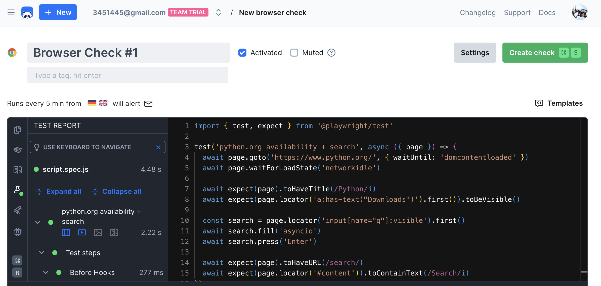
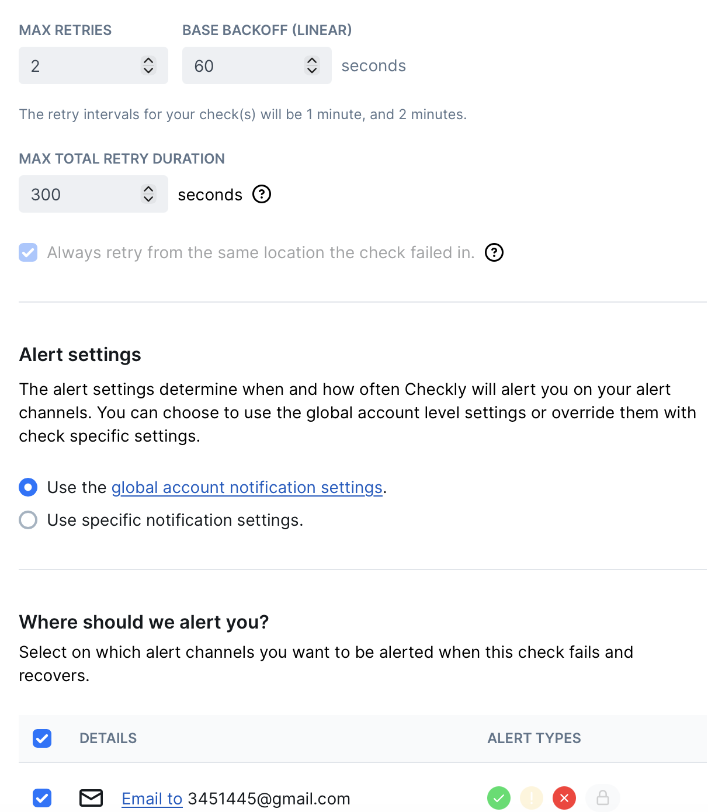
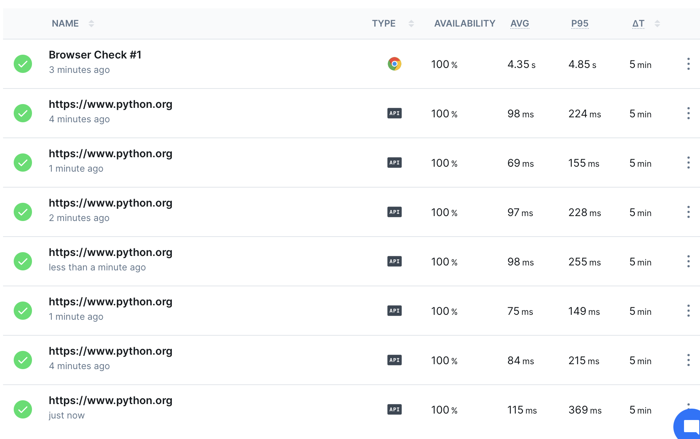
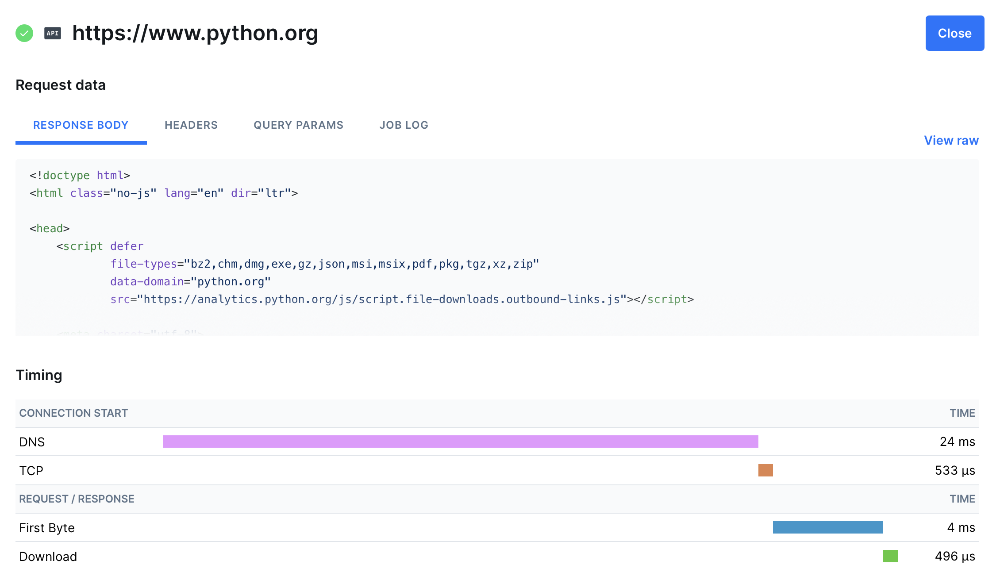

# Task 1 — Key Metrics for SRE and System Analysis


## 1.1 Monitor System Resources

### Installed monitoring tools
```bash
sudo apt update
sudo apt install htop sysstat -y
sudo apt install iotop -y
```

```bash
$ sudo apt update
...
208 packages can be upgraded. Run 'apt list --upgradable' to see them.

$ sudo apt install htop sysstat -y
sysstat is already the newest version (12.7.7-0ubuntu1).
Installing: htop
...

$ sudo apt install -y iotop
Installing: iotop
...
```

### Commands used
```bash
htop
iostat -x 1 5
ps -eo pid,comm,pcpu,pmem --sort=-pcpu | head -n 4
ps -eo pid,comm,pcpu,pmem --sort=-pmem | head -n 4
sudo iotop -o -b -n 15
```

### iostat fields (required understanding)
- `%user`: CPU time in user space
- `%system`: CPU time in kernel space
- `%iowait`: CPU waiting for I/O operations
- `%idle`: CPU idle time

### Top 3 resource consumers

#### CPU usage (top real applications)
1. `snapd` — `7.8% CPU`, `1.2% MEM`
2. `gnome-shell` — `6.4% CPU`, `13.0% MEM`
3. `ptyxis` — `4.7% CPU`, `8.6% MEM`

Note: `ps` и `head` попали в верхние строки в одном из замеров, потому что это сами команды измерения.

#### Memory usage
1. `gnome-shell` — `13.0% MEM`
2. `ptyxis` — `8.6% MEM`
3. `mutter-x11-fram...` — `3.2% MEM`

#### I/O usage
1. `http` (user `_apt`) — up to `2.30 M/s` write during package activity
2. `[jbd2/sda2-8]` — up to `47.44 K/s` write (journal flush activity)
3. `gnome-shell` — up to `7.89 K/s` read in active session

### Command outputs (resource consumption)
```bash
$ iostat -x 1 5
Linux 6.17.0-19-generic (laba5)  _aarch64_  (2 CPU)

avg-cpu:  %user   %nice %system %iowait  %steal   %idle
          14.57    0.69    6.32    0.87    0.00   77.55

... (later samples)
avg-cpu:  %user   %nice %system %iowait  %steal   %idle
          22.62    0.00    4.17    0.00    0.00   73.21

Device            r/s     rkB/s ...   w/s     wkB/s ...  %util
sda             79.46   6236.31 ... 42.66   4893.67 ...   2.81
```

```bash
$ ps -eo pid,comm,pcpu,pmem --sort=-pcpu | head -n 4
    PID COMMAND         %CPU %MEM
   5368 ps             100  0.1
   5369 head            50.0 0.1
   1100 snapd            7.8 1.2
```

```bash
$ ps -eo pid,comm,pcpu,pmem --sort=-pmem | head -n 4
    PID COMMAND         %CPU %MEM
   2562 gnome-shell      6.4 13.0
   3951 ptyxis           4.7 8.6
   3996 mutter-x11-fram  0.0 3.2
```

```bash
$ sudo iotop -o -b -n 15
...
Total DISK READ:         0.00 B/s | Total DISK WRITE:         2.30 M/s
Current DISK READ:       0.00 B/s | Current DISK WRITE:       0.00 B/s
  TID  PRIO  USER     DISK READ DISK WRITE SWAPIN     IO    COMMAND
 6160 be/4 _apt         0.00 B/s    2.30 M/s ?unavailable? http
...
Total DISK READ:         7.89 K/s | Total DISK WRITE:         2.16 M/s
Current DISK READ:       7.89 K/s | Current DISK WRITE:       0.00 B/s
  TID  PRIO  USER     DISK READ DISK WRITE SWAPIN     IO    COMMAND
 6160 be/4 _apt         0.00 B/s    2.16 M/s ?unavailable? http
 2562 be/4 vboxuser     7.89 K/s    0.00 B/s ?unavailable? gnome-shell
...
Total DISK READ:         0.00 B/s | Total DISK WRITE:        47.44 K/s
Current DISK READ:       0.00 B/s | Current DISK WRITE:      75.12 K/s
  TID  PRIO  USER     DISK READ DISK WRITE SWAPIN     IO    COMMAND
  299 be/3 root         0.00 B/s  47.44 K/s ?unavailable? [jbd2/sda2-8]
...
Total DISK READ:         0.00 B/s | Total DISK WRITE:         7.81 K/s
Current DISK READ:       0.00 B/s | Current DISK WRITE:      19.52 K/s
  TID  PRIO  USER     DISK READ DISK WRITE SWAPIN     IO    COMMAND
  299 be/3 root         0.00 B/s   7.81 K/s ?unavailable? [jbd2/sda2-8]
...
```

## 1.2 Disk Space Management

### Check disk usage
```bash
$ df -h
Filesystem      Size  Used Avail Use% Mounted on
tmpfs           677M  1.9M  675M   1% /run
/dev/sda2        24G  8.9G   14G  40% /
tmpfs           1.7G     0  1.7G   0% /dev/shm
efivarfs        256K   32K  225K  13% /sys/firmware/efi/efivars
tmpfs           5.0M  8.0K  5.0M   1% /run/lock
tmpfs           1.7G  8.0K  1.7G   1% /tmp
/dev/sda1       1.1G  6.6M  1.1G   1% /boot/efi
tmpfs           339M   96K  339M   1% /run/user/1000
/dev/sr0        4.7G  4.7G     0 100% /media/vboxuser/Ubuntu 25.10 arm64
```

```bash
$ du -h /var | sort -rh | head -n 10
du: cannot read directory ... Permission denied
... (multiple protected directories)
3.3G  /var
3.0G  /var/lib
2.7G  /var/lib/snapd
2.6G  /var/lib/snapd/snaps
164M  /var/log
161M  /var/log/journal/4793bc6817304b2eb81657150578b550
161M  /var/log/journal
148M  /var/lib/apt/lists
148M  /var/lib/apt
141M  /var/cache
```

### Top 3 largest files in `/var`
```bash
$ sudo find /var -type f -exec du -h {} + | sort -rh | head -n 3
553M  /var/lib/snapd/snaps/gnome-46-2404_154.snap
553M  /var/lib/snapd/cache/37b852c1861182e7a518b849062c85f15aec4b9eb59eabec3...
503M  /var/lib/snapd/snaps/gnome-42-2204_245.snap
```

## Analysis
- Основной объем в `/var` занимает `/var/lib/snapd`, особенно snap-пакеты и кэш.
- Память в основном расходуют процессы графической среды (`gnome-shell`, терминал, оконный менеджер).
- В простое дисковая активность низкая, но во время работы `apt` процесс `_apt/http` становится главным источником записи (примерно `2.0–2.3 M/s`).
- Короткие всплески записи также связаны с журналированием файловой системы (`jbd2`).
- По `iostat` видно низкий `iowait` (`0.00–0.87`) и в целом высокий `idle` (`73–89%`), то есть система обычно не упирается в диск.
- Корневой раздел заполнен умеренно (`40%`), критического дефицита места сейчас нет.

## Reflection (optimization plan)
- Удалять старые ревизии Snap и очищать кэш, чтобы уменьшить размер `/var/lib/snapd`.
- Периодически очищать кэш пакетов и контролировать ротацию логов.
- Повторять замеры I/O под рабочей нагрузкой, чтобы получать более репрезентативный top-3 по диску.
- Регулярно проверять систему через `htop`, `iostat` и `iotop` до и после тяжелых задач, чтобы заранее замечать всплески.


# Task 2 — Practical Website Monitoring Setup

## Objective
Set up real-time monitoring for a public website using Checkly with availability checks, content validation, interaction performance, and alerting.

## 2.1 Choose Your Website
- Selected target website: `https://www.python.org`

## 2.2 Create Checks in Checkly

### API Check (Basic Availability)
- URL: `https://www.python.org`
- Method: `GET`
- Assertion: status code `200`
- Frequency: every `5 min`

### Browser Check (Content + Interaction)
- Browser check name: `Browser Check #1`
- Frequency: every `5 min`
- Validated behavior:
1. Open `https://www.python.org/`
2. Validate page title contains `Python`
3. Validate `Downloads` element is visible
4. Enter `asyncio` in search input and submit
5. Validate URL contains `/search/`
6. Validate search page content is shown

## 2.3 Set Up Alerts
- Notification channel: Email (`3451445@gmail.com`)
- Alert behavior: alerts on check failures and recoveries
- Retry settings used:
1. Max retries: `2`
2. Base backoff (linear): `60 seconds`
3. Max total retry duration: `300 seconds`

## 2.4 Capture Proof & Documentation

### 1. Browser check configuration


### 2. Alert settings


### 3. Successful check result

 
### 4. Dashboard overview


## Analysis
- Были выбраны два типа проверок, чтобы покрыть и доступность, и реальный пользовательский сценарий.
- API Check быстро выявляет недоступность сайта (HTTP-уровень).
- Browser Check проверяет пользовательский путь (страница открывается, элементы видимы, поиск работает).
- Интервал `5 min` дает баланс между своевременным обнаружением проблем и лишней нагрузкой.
- Retry-настройки уменьшают ложные срабатывания из-за кратковременных сетевых ошибок.

## Reflection
- Такая схема мониторинга позволяет ловить как полные отказы, так и «тихие» проблемы интерфейса.
- Совмещение API и Browser проверок повышает уверенность, что сайт работает не только технически, но и функционально для пользователя.
- Настроенные алерты дают быстрый сигнал о проблеме и ускоряют реакцию на инциденты.
