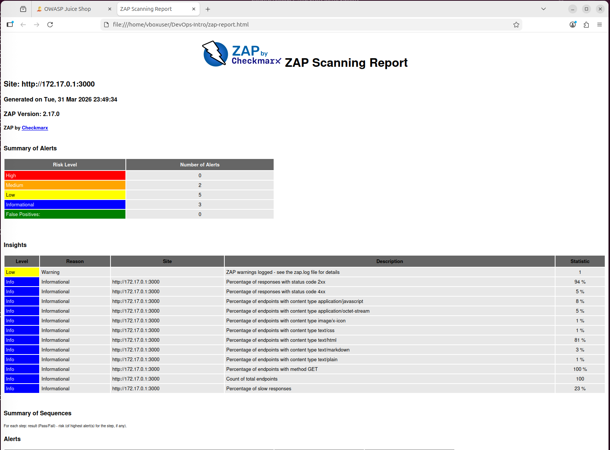
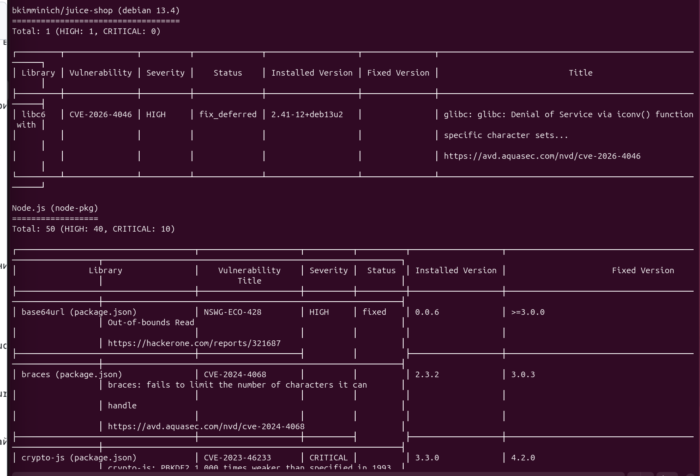

## Task 1 — Web Application Scanning with OWASP ZAP

### Command

 ```bash
   docker run --rm -u zap -v $(pwd):/zap/wrk:rw \
   -t ghcr.io/zaproxy/zaproxy:stable zap-baseline.py \
   -t http://host.docker.internal:3000 \
   -g gen.conf \
   -r zap-report.html
   ```

### Target
- Application: Juice Shop
- Scanned URL: `http://172.17.0.1:3000`
- Scan tool: OWASP ZAP Baseline Scan
- Report generated: `Tue, 31 Mar 2026 23:49:34`
- ZAP version: `2.17.0`

### Results Summary
- High risk vulnerabilities: `0`
- Medium risk vulnerabilities: `2`
- Low risk vulnerabilities: `5`
- Informational findings: `3`

### Two Most Interesting Medium-Risk Vulnerabilities

#### 1. Content Security Policy (CSP) Header Not Set
Эта уязвимость означает, что приложение не отправляет заголовок `Content-Security-Policy`. CSP нужен для того, чтобы ограничивать, какие скрипты, стили, изображения и другие ресурсы браузер может загружать на странице. Если этот заголовок отсутствует, защита от атак типа Cross-Site Scripting (XSS) и внедрения вредоносного кода становится слабее. В отчёте указано, что проблема является системной и затрагивает несколько ресурсов приложения, включая главную страницу, `/ftp` и `sitemap.xml`.

#### 2. Cross-Domain Misconfiguration
Эта уязвимость показывает, что приложение использует слишком открытую CORS-конфигурацию. В качестве доказательства в отчёте указан заголовок `Access-Control-Allow-Origin: *`. Это означает, что доступ к ресурсам разрешён с любого внешнего домена, что ослабляет политику Same-Origin Policy браузера. На практике такая настройка может позволить сторонним сайтам получать доступ к неаутентифицированным данным и повышает риск утечки информации.

### Security Headers Status

#### Missing or Invalid Headers
- `Content-Security-Policy`
  Этот заголовок отсутствует. Он важен, потому что помогает защищаться от XSS и других атак, связанных с внедрением контента.
- `Cross-Origin-Embedder-Policy`
  Этот заголовок отсутствует или настроен некорректно. Он ограничивает загрузку внешних ресурсов, если те явно не разрешены.
- `Cross-Origin-Opener-Policy`
  Этот заголовок отсутствует или настроен некорректно. Он нужен для изоляции контекста браузера и уменьшения риска утечки данных между окнами или вкладками.

#### Present Headers
- `Access-Control-Allow-Origin: *`
  Этот заголовок присутствует, но настроен небезопасно, потому что разрешает доступ с любого источника.
- `Feature-Policy`
  Этот заголовок присутствует, но в отчёте отмечен как устаревший. Вместо него рекомендуется использовать `Permissions-Policy`.
- `Cache-Control: max-age=0`
  Этот заголовок присутствует и влияет на кэширование ответов, хотя напрямую не защищает от веб-атак.

### Screenshot


### Analysis
По результатам сканирования наиболее заметные проблемы связаны с неправильной настройкой HTTP-заголовков безопасности и политик доступа между источниками. Это типичная ситуация для веб-приложений, потому что при разработке часто больше внимания уделяется функциональности, чем защитным механизмам браузера. Отсутствие таких заголовков, как CSP, и слишком открытая CORS-конфигурация не всегда приводят к атаке сразу, но заметно ослабляют встроенную защиту браузера. В целом можно сделать вывод, что для веб-приложений очень характерны уязвимости, связанные с misconfiguration, недостаточной настройкой security headers и слабой клиентской защитой.


## Task 2 — Container Vulnerability Scanning with Trivy

### Command

 ```bash
   docker run --rm -v /var/run/docker.sock:/var/run/docker.sock \
   aquasec/trivy:latest image \
   --severity HIGH,CRITICAL \
   bkimminich/juice-shop
   ```

### Results Summary

- Total count of CRITICAL vulnerabilities: `10`
- Total count of HIGH vulnerabilities: `41`
- Total vulnerabilities with severity HIGH/CRITICAL: `51`
  
### Vulnerable Packages
- `libc6` — `CVE-2026-4046` — `HIGH`
  
Уязвимость связана с glibc и может приводить к `Denial of Service` через функцию `iconv()`.

- `crypto-js` — `CVE-2023-46233` — `CRITICAL`
  
Уязвимость связана с ослабленной реализацией PBKDF2, из-за чего криптографическая защита становится значительно слабее.

- `vm2` — `CVE-2023-32314` — `CRITICAL`
  
Это уязвимость типа Sandbox Escape, которая потенциально позволяет выйти из песочницы и выполнить произвольный код.

- `jsonwebtoken` — `CVE-2015-9235` — `CRITICAL`
  
Эта уязвимость позволяет обойти этап проверки токена, что создаёт риск подделки авторизации.

### Most Common Vulnerability Type
Наиболее часто встречались уязвимости в устаревших Node.js пакетах, особенно связанные с:

- `Denial of Service (DoS / ReDoS)`
- `Remote Code Execution`
- `Authorization / Verification Bypass`
- `Prototype Pollution`
  
Если выбрать один наиболее частый тип, то по результатам этого сканирования чаще всего встречались уязвимости, связанные с `Denial of Service` в сторонних библиотеках.

### Screenshot


### Analysis
Сканирование контейнерных образов важно выполнять до деплоя в production, потому что образ может содержать уязвимые системные пакеты и небезопасные зависимости приложения. Если не проверять контейнер заранее, такие уязвимости попадут в production вместе с приложением и увеличат поверхность атаки. Trivy помогает заранее увидеть критичные проблемы, определить затронутые библиотеки и понять, какие версии нужно обновить в первую очередь.

### Reflection
Такие проверки можно встроить в `CI/CD` pipeline как отдельный security stage. Например, после сборки Docker image pipeline может автоматически запускать Trivy и завершать сборку с ошибкой, если найдены CRITICAL уязвимости. Отчёты сканирования можно сохранять как `build artifacts`, чтобы команда могла просмотреть результаты и запланировать исправления. Такой подход соответствует идее DevSecOps: переносить проверки безопасности как можно раньше в процесс разработки.
